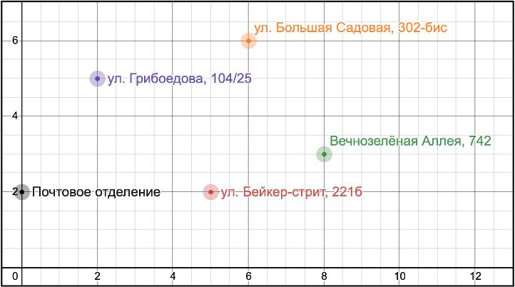

## Задача 1

Разработать программу для вычисления кратчайшего пути для почтальона.

### Описание задачи
Почтальон выходит из почтового отделения, объезжает всех адресатов один раз для вручения посылки
и возвращается в почтовое отделение.

Необходимо найти кратчайший маршрут для почтальона.

### Карта адресатов



#### Координаты точек

1. Почтовое отделение – **(0, 2)**
2. Ул. Грибоедова, 104/25 – **(2, 5)**
3. Ул. Бейкер стрит, 221б – **(5, 2)**
4. Ул. Большая Садовая, 302-бис – **(6, 6)**
5. Вечнозелёная Аллея, 742 – **(8, 3)**

#### Описание решения

Общее количество всех возможных путей проезда вычисляется по формуле **(n - 1)!**,
где **n** – количество точек (адресатов).

Расчёт количества возможных маршрутов объезда адресатов для данной карты: *(5 - 1)! = 4! = 24 (маршрута)*.
Необходимо найти кратчайший маршрут и вывести последовательность точек, которые его составляют.

Для поиска такого маршрута необходимо вычислять расстояния между точками, составляющих маршрут.
Это позволит найти общую длину маршрута. Путем перебора длин всех возможных маршрутов найти самый короткий из них.

Расстояние между двумя точками на плоскости вычисляется по формуле:


Где *x1* и *y1* – координаты первой точки, *x2* и *y2* – координаты второй точки. 

### Запуск программы

Для запуска расчета оптимального пути запустите файл `main.py`.

Результат работы программы оформлен следующим образом:
```
(0, 2) -> (2, 5)[3.605551275463989] -> (6, 6)[7.728656901081649] -> (8, 3)[11.334208176545639] -> (5, 2)[14.496485836714019] -> (0, 2)[19.49648583671402] = 19.49648583671402
```
Координаты точек, следующие друг за другом, показывают найденный кратчайший путь с указанием промежуточной длины пути у каждой следующей точки.
Полная продолжительность всего маршрута указана после символа равенства.

#### Оптимальный маршрут отображается на графике

## Задача 2

Разработать игру «Обратные крестики-нолики» на поле 10 x 10 с правилом «Пять в ряд» – проигрывает тот,
у кого получился вертикальный, горизонтальный или диагональный ряд из пяти своих фигур (крестиков/ноликов).

### Описание задачи
Игра работает в режиме «человек против компьютера».

Игра поддерживает графический интерфейс.

### Запуск программы
Для игры «Обратные крестики-нолики» запустите файл `main.py`.

### О программе

Так выглядит игровое поле:


Чтобы начать новую игру нужно нажать кнопку сниз игрового экрана.

Игрок ходит первым и ставит крестики, компьютер ставит нолики.
Игровой процесс:


Ход, при котором игра заканчивается, подсвечивается красным цветом.
Проигрыш:


Победа:


## Задача 3

При помощи ООП спроектировать и реализовать геометрический калькулятор для вычислений, производимых над фигурами. Калькулятор должен поддерживать вычисления для плоских и объемных фигур.

Плоские фигуры: **круг, квадрат, прямоугольник, треугольник, трапеция, ромб**.

Объемные фигуры: **сфера, куб, параллелепипед, пирамида, цилиндр, конус**.

### Описание задачи
Реализован один общий метод вычисления для всех фигур и один специфичный для определенных фигур.

Реализован графический интерфейс для возможностей взаимодействия пользователя с программой и визуализации фигур (с учетом введенных параметров фигуры).

### Запуск программы
Для использования «Геометрического калькулятора» запустите файл `main.py`.

### О программе

Интерфейс калькулятора:


Расчет плоских фигур:


Построение круга:


Расчет объемных фигур:


Построение цилиндра:


####При вводе отрицательных величин программа сигнализирует о недопустимости ввода.


####Построенные фигуры можно сохранять на жесткий диск в форматах jpeg. и png.

### Тестирование
Из корневой дирректории для запуска автотестов введите: `python -m pytest task_3/tests`.